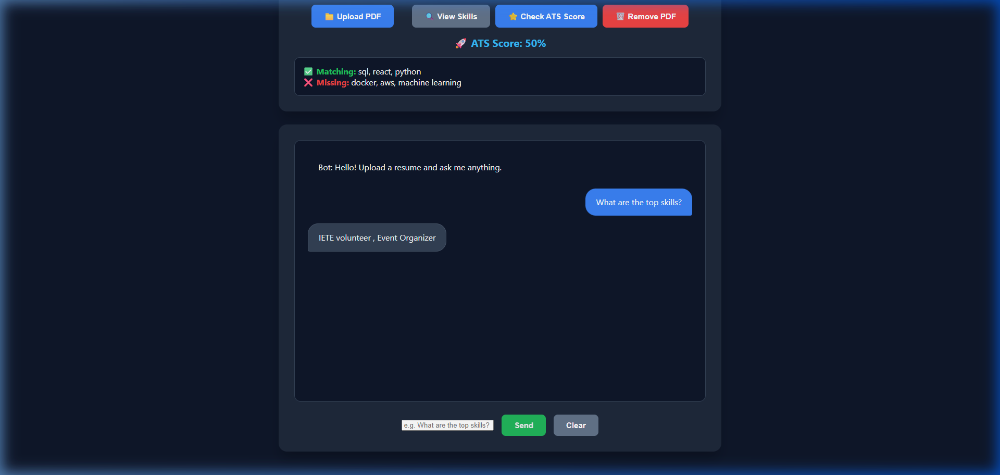
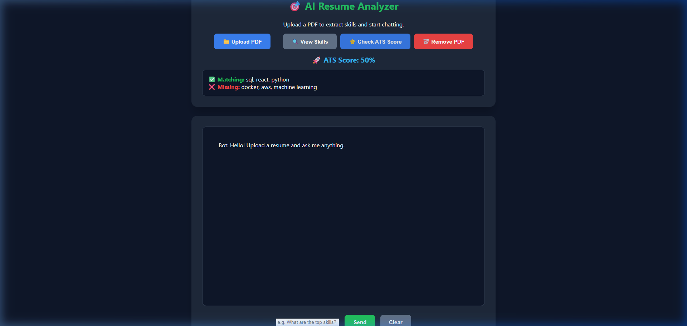
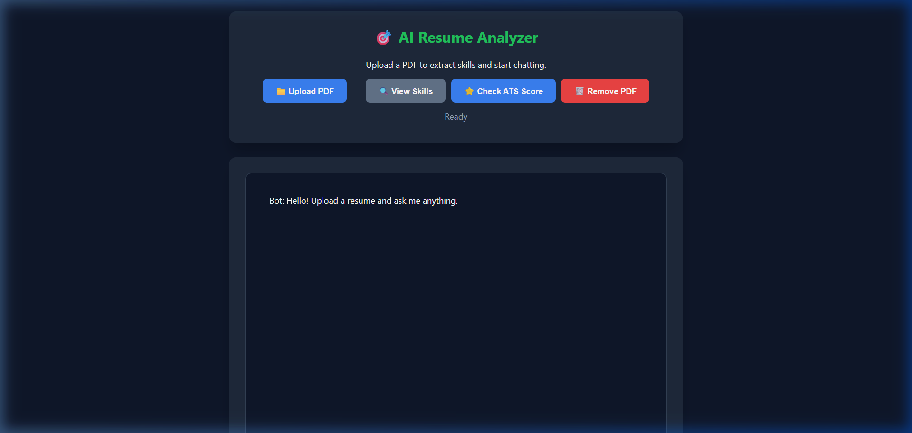

# 🤖 AI Resume Analyzer Pro 🚀

An **AI-powered recruitment assistant** that analyzes resumes using **Vector Embeddings, Semantic Search, and Retrieval-Augmented Generation (RAG)**.

The system extracts insights from resumes, identifies technical skills, calculates ATS compatibility with job descriptions, and provides intelligent answers to recruiter queries.

This project demonstrates how modern **AI + Vector Databases** can improve recruitment workflows.

---

# 🌟 Key Features

* 📄 **Automated PDF Processing**
  Instantly extracts text from uploaded resumes using `pdfplumber`.

* 🤖 **RAG-based Chatbot**
  Uses a Large Language Model (**FLAN-T5**) combined with **Endee Vector Database** to generate accurate answers.



* 🔎 **Semantic Search**
  Understands resume meaning rather than relying only on keyword matching.

* 🧠 **Skill Extraction**
  Automatically identifies technical skills from the candidate’s resume.

* 📊 **ATS Score Calculation**
  Compares resume skills with job requirements and generates a match percentage.



* 💡 **Smart Suggestions**
  Suggests relevant follow-up questions to help recruiters explore the candidate profile.

* ⚡ **Real-time Chat Interface**
  Recruiters can interact with the AI through a chatbot interface.

---

# 🏗️ System Architecture

The system follows a **Retrieval-Augmented Generation (RAG)** architecture.

### 1️⃣ Ingestion Layer

* Users upload a resume PDF.
* Text is extracted using **pdfplumber**.
* Content is divided into smaller chunks for processing.

### 2️⃣ Vectorization

* Each text chunk is converted into **384-dimensional embeddings** using the **all-MiniLM-L6-v2 transformer model**.

### 3️⃣ Storage (Vector Database)

* These embeddings are stored in the **Endee Vector Database**.
* This allows fast semantic similarity search.

### 4️⃣ Retrieval

* When a user asks a question, the system queries the vector database.
* The most relevant resume sections are retrieved.

### 5️⃣ AI Answer Generation

* Retrieved resume context + user question are sent to the **FLAN-T5 language model**.
* The model generates a concise, factual answer.

---

# 🛡️ Role of Endee Vector Database

The **Endee Vector Database** acts as the **core memory** of the system.

It is used for:

* **Vector Index Management**

  * Create and manage resume indexes dynamically.

* **Semantic Search**

  * Enables concept-based search rather than simple keyword matching.

Example:

Question:
Cloud experience

Resume text:
AWS deployment, Azure infrastructure

Even if the word **cloud** is missing, semantic search still finds the relevant content.

* **High Performance Retrieval**

  * Lightweight and optimized for fast local AI applications.

---

# ⚙️ Implementation Example

Example query to retrieve relevant resume context:

```python
results = db.query("resumes", query_vector=query_embedding, top_k=3)

context = " ".join([res["text"] for res in results])
```

This retrieved context is passed to the language model for answer generation.

---

# 🛠 Tech Stack

* Python
* Flask (Backend API)
* Sentence Transformers (Embeddings)
* Transformers (FLAN-T5 AI model)
* Endee Vector Database
* HTML / CSS / JavaScript (Frontend)
* pdfplumber (PDF text extraction)

---

# 📂 Project Structure

```
resume-analyzer

├── app.py               # Main Flask application and AI logic
├── embed.py             # Embedding generation and Endee integration
├── requirements.txt     # Project dependencies
├── README.md

├── templates
│    └── index.html      # Chatbot interface

├── uploads
│    └── resume.pdf      # Uploaded resume files

└── data
     ├── resume.txt      # Extracted resume text
     └── job.txt         # Job description for ATS scoring
```

---

# 🚀 Installation

Clone the repository

```
git clone https://github.com/YOUR_USERNAME/endee.git
```

Navigate to the project folder

```
cd endee/resume-analyzer
```

Install dependencies

```
pip install -r requirements.txt
```

---

# ▶️ Running the Project

Step 1: Generate Resume Embeddings

```
python embed.py
```

Step 2: Start the Flask Application

```
python app.py
```

Open the application in your browser

```
http://127.0.0.1:5000
```

---

# 💬 Example Questions

Recruiters can ask questions such as:

* What skills does the candidate have?
* What programming languages does the candidate know?
* What experience does the candidate have?
* What projects has the candidate worked on?
* Is the candidate suitable for a Python developer role?

---

# 📊 ATS Score Feature

The system compares **resume skills** with **job requirements** and calculates a match score.

Example Output:

ATS Score: **80%**

Matching Skills
Python, SQL, React

Missing Skills
Docker, AWS

---

# 📸 Screenshots



---

# 🎯 Project Goals

This project demonstrates:

* Practical **RAG implementation** using open-source AI models
* **Vector database integration** for semantic search
* **AI-powered resume analysis** for recruitment systems
* A **professional recruiter-focused user interface**

---

# 📌 Future Improvements

* Multi-resume comparison
* Resume ranking system
* AI-based resume summarization
* Job recommendation engine
* Cloud deployment

---

# 👨💻 Author

**Reddi Obulesh**

Electronics and Communication Engineering Graduate
Aspiring Software Developer
